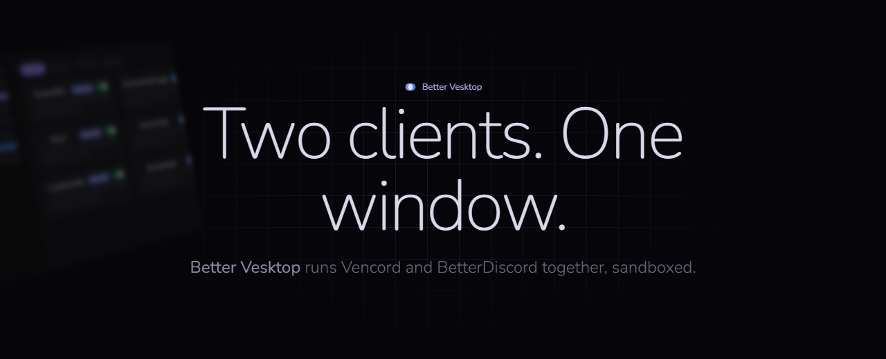

<p align="center">
  
</p>

<p align="center">
  <b>English</b> · <a href="README.ru.md">Русский</a> · <a href="https://kolyagames.github.io/better_vesktop/">Website</a>
</p>

# Better Vesktop

[Vesktop](https://github.com/Vencord/Vesktop) with [BetterDiscord](https://betterdiscord.app) built in. Vencord plugins and BetterDiscord plugins live in one client, in one settings menu, and Discord's window stays sandboxed.

> Unofficial. Not affiliated with Discord, Vencord, Vesktop or BetterDiscord.

## What you get

- **One settings section.** Vencord and BetterDiscord are merged into a single "Better Vesktop" section instead of two separate ones.
- **One plugin list.** A single Plugins page shows the plugins of both clients side by side, with search and filters (All, Vencord, BetterDiscord, Enabled, Disabled), switches and per-plugin settings. The BetterDiscord addon store is one click away.
- **Still sandboxed.** Stock BetterDiscord needs Node.js inside Discord's window. Better Vesktop keeps the window sandboxed like Vesktop does and gives BetterDiscord a narrow bridge instead, see [Security](#security).
- **Portable.** Settings, session, plugins and themes live in two folders next to the app. Nothing is written to the registry and nothing else on the PC is touched.

## Install

1. Download the latest `.zip` from the [releases page](https://github.com/kolyagames/better_vesktop/releases/latest).
2. Unpack the folder anywhere except `Program Files` and run `better-vesktop.exe`.
3. Windows SmartScreen may warn you because the build is not signed: choose **More info**, then **Run anyway**.
4. Sign in to Discord.

Delete the folder to remove everything. If you already use BetterDiscord, copy your plugins and themes into the `BetterDiscord` folder next to the app.

The release also contains an installer (`.exe`) that keeps the app up to date by itself.

## Security

Discord's page and every plugin run in a sandboxed renderer with no Node.js. BetterDiscord talks to the computer only through a bridge in the main process (`src/main/betterdiscord`), and that bridge decides what is allowed:

| Plugins can | Plugins can't |
| --- | --- |
| read and write inside the BetterDiscord folder | touch any other file or folder |
| open files you pick yourself in a file dialog | reach `localhost` or devices on your network |
| fetch websites and APIs on the internet | start programs or open executables |
| open `http(s)` and `mailto` links | post to Discord webhooks, use `file://`, or send arbitrary IPC to the app |

A plugin is still code that runs inside your Discord page, so it can see and change what the page shows. Install plugins from the BetterDiscord store or from authors you trust.

Limits can be loosened in `Data/settings.json`:

```json
{
    "betterDiscord": {
        "enabled": true,
        "allowLocalNetwork": false,
        "extraPaths": ["D:/Music"]
    }
}
```

Start with `--vanilla` to run once without BetterDiscord. Details and how to report a problem: [SECURITY.md](SECURITY.md).

## Compatibility

- Most BetterDiscord plugins work. Plugins that need the desktop Discord's native `DiscordNative` API can't work in Vesktop, and plugins that read files outside the allowed folders are blocked by the sandbox.
- Vencord plugins work as in Vesktop.
- Windows 10 and 11 (x64) is what the releases are built and tested on. Other platforms build from source but are untested.

## Build from source

Requires Node.js 22+ and pnpm 11+.

```sh
pnpm install
pnpm build            # production build into dist/
pnpm start            # build and run
pnpm package          # installer and zip with electron-builder
```

Use `pnpm start:dev` while working. `BETTER_VESKTOP_BD_DIR` points BetterDiscord at a different folder, handy for testing.

How it fits together:

| Part | Where |
| --- | --- |
| BetterDiscord's release, pinned and checksummed | `vendor/betterdiscord` |
| Patches applied to its renderer at build time | `scripts/build/betterdiscord.mts` |
| Sandboxed preload bridge | `src/preload/betterdiscord.ts` |
| Main process side: paths, network, windows, editor | `src/main/betterdiscord` |
| Merged settings and the unified plugin page | `src/renderer/betterVesktop` |

## FAQ

**Can I get banned?** Discord's rules forbid client mods, which includes Vencord and BetterDiscord. In practice bans for themes and cosmetic plugins are not known; the risk comes from plugins that automate actions. Better Vesktop changes nothing about what Discord's servers see.

**Why a fork and not a plugin?** BetterDiscord has to start before Discord's code and needs its own privileged helpers, which a Vencord plugin can't provide.

## Authors

- **kolyagames**: owner and maintainer of the project.
- **Claude** (Anthropic): developer. Most of the code was written by Claude together with the owner.

## Credits and license

Better Vesktop is based on [Vesktop](https://github.com/Vencord/Vesktop) by Vendicated and contributors, and bundles [Vencord](https://github.com/Vendicated/Vencord) (loaded by Vesktop) and [BetterDiscord](https://github.com/BetterDiscord/BetterDiscord) (Apache-2.0, see `vendor/betterdiscord/LICENSE`). Fonts on the website are Nunito and JetBrains Mono (SIL OFL).

Licensed under the [GPL-3.0-or-later](LICENSE).
